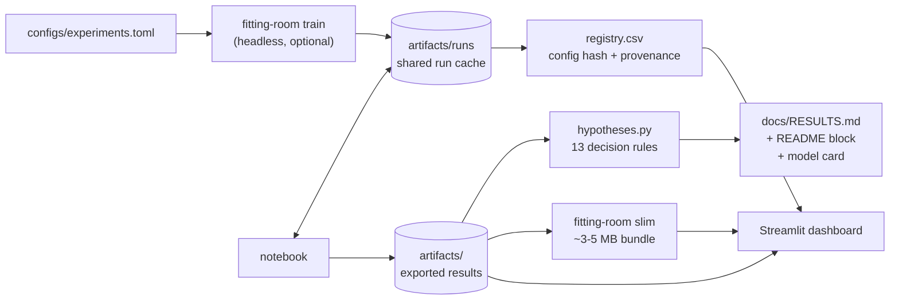

# The Fitting Room

**One fixed neural network, six ways to train it, and a careful look at how much of what it learns actually transfers.**

[](https://github.com/<your-username>/fitting-room/actions/workflows/ci.yml)


[](https://colab.research.google.com/github/<your-username>/fitting-room/blob/main/notebooks/generalization_study.ipynb)
[](https://ucqmyj72uecdeeiphuy95x.streamlit.app/)

Weight initialization, L2 regularization, dropout, and early stopping are usually switched on together, which makes it hard to say what any one of them does. This project takes them apart. A 784–128–128–10 ReLU network is trained on Fashion-MNIST with everything held fixed (data split, optimizer, batch size, epoch budget) except one technique at a time. Every run records diagnostics that Keras does not report, thirteen predictions were written down before the experiment ran, and the results report is generated from the data so the write-up cannot drift from the numbers.

The name comes from the domain. In clothing and in machine learning, *fit* means the same thing: too tight is overfitting, too loose is underfitting, and the goal is something that works on bodies it was not measured on.

## Results

<!-- RESULTS:START -->
*This block is written by `make report` from the experiment outputs. Run the pipeline (see [Quickstart](#quickstart)) to fill it with the selected model, a comparison table of all configurations, the hypothesis verdicts, and the generalization-trajectory figure.*
<!-- RESULTS:END -->

## What the study asks

1. Does He initialization change how a ReLU network trains, how well it generalizes, or both?
2. How does L2 strength trade training fit against generalization, and where does it tip into underfitting?
3. Does dropout narrow the train–validation gap without costing accuracy, and why can its training accuracy fall *below* its validation accuracy?
4. Which configuration balances fit and generalization best, and how sure can we be?

Two of the answers can be worked out before training anything. In this network, Keras' default Glorot initialization leaves the second hidden layer with 0.43 of the signal power that He initialization keeps, a mild loss that should matter early and fade (He et al., 2015). And an L2 penalty of λ = 0.01 starts at about 5.1, more than twice the untrained network's cross-entropy of 2.3, which predicts underfitting before the first epoch (Krogh & Hertz, 1991). The derivations are in [docs/METHODOLOGY.md](docs/METHODOLOGY.md) and the numbers are checked by the test suite.

## What's inside

| Component | What it gives you |
|---|---|
| [`notebooks/generalization_study.ipynb`](notebooks/generalization_study.ipynb) | The full narrative: data, six controlled experiments, selection, a single test evaluation, 22 figures, and six extension studies (early-stopping replay, calibration, paired McNemar tests, a three-seed robustness check, an Optuna search, t-SNE of the hidden layer). |
| [`app.py`](app.py) | **The Fitting Room** dashboard: 12 interactive views, including an animated generalization-trajectory chart, a head-to-head model comparison with a live significance test, a hypothesis scorecard, and a lab where you perturb or upload a garment and watch every model respond. |
| [`src/fitting_room/`](src/fitting_room) | A small, tested package: NumPy-only analysis (calibration, Wilson and bootstrap intervals, exact McNemar, Holm, early-stopping replay, signal-propagation theory), a headless trainer, pre-registered hypotheses, the report generator, and a storage-aware exporter. |
| [`docs/HYPOTHESES.md`](docs/HYPOTHESES.md) | Thirteen predictions with numeric decision rules, frozen before the full run. |
| [`docs/METHODOLOGY.md`](docs/METHODOLOGY.md) | What was done and why, with the analytic results, statistical choices, and threats to validity. |
| `docs/RESULTS.md` | Generated by `make report`: every conclusion next to the numbers that prove it. |
| [`MODEL_CARD.md`](MODEL_CARD.md), [`DATASHEET.md`](DATASHEET.md) | Intended use, limits, and data provenance, following Mitchell et al. (2019) and Gebru et al. (2021). |
| [`configs/experiments.toml`](configs/experiments.toml) | The protocol and the six configurations in one place. |

## How it fits together



The notebook and the headless trainer write runs in the same format, so you can train on a server with `make train` and the notebook will load every run from the cache instead of retraining.

## Quickstart

```bash
git clone https://github.com/<your-username>/fitting-room.git
cd fitting-room
pip install -e ".[notebook,app,dev]"

make train      # optional: all configurations and seeds, headless (about 45-60 min on a CPU)
make notebook   # runs the analysis; reuses any cached runs
make report     # writes docs/RESULTS.md, compressed figures, and this README's results block
make app        # opens the dashboard
```

To run only the core experiments, set `RUN_SEED_STUDY = False` and `RUN_TUNING = False` in the notebook's configuration cell (about 10–15 minutes on a CPU). On Google Colab, use the badge above; the notebook installs Optuna itself if it is missing.

Other commands:

```bash
python -m fitting_room hypotheses    # print the scorecard in the terminal
python -m fitting_room registry      # rebuild artifacts/registry.csv from the run cache
python -m fitting_room slim --budget-mb 8   # deploy-ready copy of the artifacts
make test                            # unit tests (no TensorFlow needed)
```

## The dashboard

| View | What you can do |
|---|---|
| Overview | Watch every model's path through training-vs-validation accuracy, epoch by epoch; download Table 1 and the results report. |
| The garments | Browse each class, its average image, and its closest look-alikes. |
| Learning curves | Compare any models on accuracy, loss, data-only cross-entropy, the clean gap, or weight norm. |
| Initialization | A signal-propagation calculator for any width and depth, next to what was measured in the untrained networks. |
| Regularization | Weight norms, the penalty's share of the objective, first-layer weight maps, and the three ways to measure training accuracy under dropout. |
| Early stopping | Move the patience slider and see where each model would stop and which weights it would keep. |
| Tuning | The Optuna study in history, importance, 3D landscape, and parallel-coordinates views. |
| Final model | Confusion matrix with a click-through gallery of errors, per-class metrics, calibration, t-SNE, seeds, and McNemar tests. |
| Head to head | Pick any two models; get their agreement table, an exact McNemar test, per-class edges, and the images they disagree on. |
| Hypotheses | The pre-registered predictions, their rules, and the computed verdicts. |
| Run registry | Every cached run with its configuration fingerprint, seed, and provenance. |
| Try it on | Add noise, occlusion, shifts, or dimming to a garment (or upload a photo) and see all models respond; run a robustness sweep. |

To deploy on Streamlit Community Cloud, run `make slim`, commit `artifacts_slim/`, and set the app's artifact path to it in the sidebar (or rename it to `artifacts/` in the deployed branch).

## Method in brief

- **Controlled design.** Each configuration differs from its parent in exactly one respect; the optimizer and learning rate are fixed on purpose, because they change the effective strength of regularization (Loshchilov & Hutter, 2019).
- **Measurements Keras does not give you.** Training accuracy with dropout off at the end of each epoch, validation cross-entropy without the L2 term, weight norms, dead ReLU units, and activation scale.
- **Honest selection.** Models are chosen on a stratified validation split and the test set is used once, after the choice is frozen (Cawley & Talbot, 2010).
- **Uncertainty as part of the result.** Wilson and bootstrap intervals, exact paired McNemar tests with Holm correction, and a three-seed robustness study (Bouthillier et al., 2021; Dietterich, 1998).
- **Pre-registration.** Predictions and decision rules were fixed before the full run, and verdicts are computed by code (Nosek et al., 2018).

## Repository layout

```
fitting-room/
├── app.py                      # Streamlit dashboard
├── configs/experiments.toml    # protocol + the six configurations
├── notebooks/generalization_study.ipynb
├── src/fitting_room/
│   ├── analysis.py             # NumPy-only metrics, tests, simulations, perturbations
│   ├── artifacts.py            # loading results, run registry
│   ├── hypotheses.py           # 13 pre-registered decision rules
│   ├── report.py               # RESULTS.md, README block, model card, figure compression
│   ├── slim.py                 # storage-aware export
│   ├── train.py                # headless trainer (same cache format as the notebook)
│   └── __main__.py             # CLI: train | registry | hypotheses | report | slim
├── tests/                      # unit + pipeline tests on a synthetic artifact set
├── docs/                       # METHODOLOGY, HYPOTHESES, RESULTS (generated), figures/
├── MODEL_CARD.md  DATASHEET.md  CITATION.cff  LICENSE
└── .github/workflows/ci.yml    # lint + tests on Python 3.11 and 3.12
```

## Storage

Everything heavy can be regenerated, so it stays out of version control.

| Output | Typical size | In git? |
|---|---|---|
| Source, notebook (outputs cleared), docs | under 1 MB | yes |
| `docs/figures/` (downscaled, palette-quantized) | about 0.5–1 MB | yes |
| `artifacts_slim/` (float16 weights and probabilities, 2,000 validation images, test errors only) | about 3–5 MB | optional, for deployment |
| `artifacts/` (full export, run cache with three weight snapshots per run, Optuna database) | about 40–60 MB | no |

The slim exporter accepts `--budget-mb` and fails if the bundle grows past it, which is a cheap guard against a repository that slowly fills up with binaries (Sculley et al., 2015). Strip notebook outputs before committing (`jupyter nbconvert --clear-output --inplace notebooks/*.ipynb`) to keep diffs readable and the history small.

## Reproducibility

Seeds are fixed for the split, initialization, shuffling, and dropout masks; the split is saved with a fingerprint; package versions are printed in the notebook; and every run in the registry carries its configuration hash and provenance. GPU kernels can differ in the last decimal places between runs; `tf.config.experimental.enable_op_determinism()` removes that at some cost in speed.

## Roadmap

- Decoupled weight decay (AdamW) against L2-through-Adam at matched strengths.
- Post-hoc temperature scaling, and calibration under the dashboard's perturbations.
- A small convolutional network on the same protocol, to measure how much of the remaining error is architectural.
- Multiple data splits, to add data-sampling variance to the seed study.

## Citation

If this is useful to you, the repository includes a [`CITATION.cff`](CITATION.cff), so GitHub's "Cite this repository" button gives a ready-made reference.

## References

Bouthillier, X., Delaunay, P., Bronzi, M., Trofimov, A., Nichyporuk, B., Szeto, J., Mohammadi Sepahvand, N., Raff, E., Madan, K., Voleti, V., Ebrahimi Kahou, S., Michalski, V., Arbel, T., Pal, C., Varoquaux, G., & Vincent, P. (2021). Accounting for variance in machine learning benchmarks. *Proceedings of Machine Learning and Systems, 3*.

Cawley, G. C., & Talbot, N. L. C. (2010). On over-fitting in model selection and subsequent selection bias in performance evaluation. *Journal of Machine Learning Research, 11*, 2079–2107.

Dietterich, T. G. (1998). Approximate statistical tests for comparing supervised classification learning algorithms. *Neural Computation, 10*(7), 1895–1923. https://doi.org/10.1162/089976698300017197

Gebru, T., Morgenstern, J., Vecchione, B., Vaughan, J. W., Wallach, H., Daumé III, H., & Crawford, K. (2021). Datasheets for datasets. *Communications of the ACM, 64*(12), 86–92. https://doi.org/10.1145/3458723

He, K., Zhang, X., Ren, S., & Sun, J. (2015). Delving deep into rectifiers: Surpassing human-level performance on ImageNet classification. In *Proceedings of the IEEE International Conference on Computer Vision* (pp. 1026–1034). https://doi.org/10.1109/ICCV.2015.123

Krogh, A., & Hertz, J. A. (1991). A simple weight decay can improve generalization. In *Advances in Neural Information Processing Systems* (Vol. 4, pp. 950–957). Morgan Kaufmann.

Loshchilov, I., & Hutter, F. (2019). Decoupled weight decay regularization. In *Proceedings of the 7th International Conference on Learning Representations*. https://arxiv.org/abs/1711.05101

Mitchell, M., Wu, S., Zaldivar, A., Barnes, P., Vasserman, L., Hutchinson, B., Spitzer, E., Raji, I. D., & Gebru, T. (2019). Model cards for model reporting. In *Proceedings of the Conference on Fairness, Accountability, and Transparency* (pp. 220–229). https://doi.org/10.1145/3287560.3287596

Nosek, B. A., Ebersole, C. R., DeHaven, A. C., & Mellor, D. T. (2018). The preregistration revolution. *Proceedings of the National Academy of Sciences, 115*(11), 2600–2606. https://doi.org/10.1073/pnas.1708274114

Sculley, D., Holt, G., Golovin, D., Davydov, E., Phillips, T., Ebner, D., Chaudhary, V., Young, M., Crespo, J.-F., & Dennison, D. (2015). Hidden technical debt in machine learning systems. In *Advances in Neural Information Processing Systems* (Vol. 28, pp. 2503–2511). Curran Associates.

Xiao, H., Rasul, K., & Vollgraf, R. (2017). *Fashion-MNIST: A novel image dataset for benchmarking machine learning algorithms* (arXiv:1708.07747). arXiv. https://doi.org/10.48550/arXiv.1708.07747

## License and acknowledgments

Code is released under the [MIT License](LICENSE). Fashion-MNIST is © Zalando SE and distributed under the MIT License by Zalando Research; this repository does not redistribute it.
