# Results

*Generated from `artifacts/` on 2026-10-08 01:57 by `python -m fitting_room report`. Do not edit by hand:
re-run the command after re-running the experiments. Split fingerprint `770af0aa560b`, seed 42,
40 epochs, batch size 128, 3 seed(s) in the robustness study.*

## Headline

The selected model is **He + dropout (p = 0.2)**, restored to epoch 40. It reached **90.25%** validation
accuracy and **88.86%** on the untouched test set (95% Wilson interval 88.23% to
89.46%; bootstrap 88.20% to 89.47%). The test set was used once,
after the choice had been fixed on validation data.

Of 13 pre-registered hypotheses, **11 were supported**, 2 were not, and 0 could not be tested in this run.

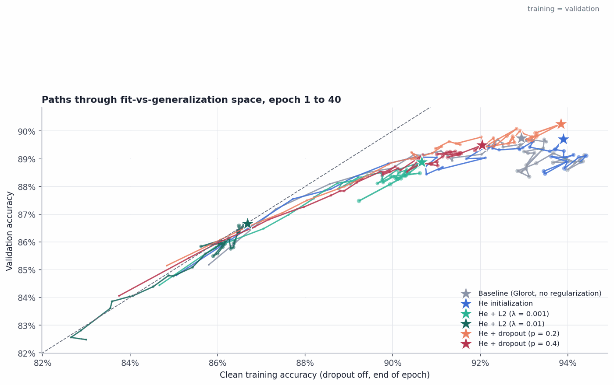
*Figure 1. Each model's path from epoch 1 to 40 in training-vs-validation accuracy space.*

## Summary comparison

| Model | Training accuracy | Validation accuracy | Key observation |
|---|---|---|---|
| Baseline (no techniques) | 93.64% | 89.74% | Validation CE bottoms out at epoch 8 and ends 43% higher; gap at best epoch 3.9 pp; overfits in confidence when trained to 40 epochs. |
| He initialization | 94.69% | 89.71% | Epoch-1 validation accuracy -0.4 pp vs. baseline; best validation -0.03 pp (within noise): an early-training effect. |
| Best L2 model (L2 0.001) | 89.83% | 88.88% | Gap at best epoch 5.0 → 1.0 pp; training accuracy -4.9 pp vs. He; a workable balance. |
| Best dropout model (Dropout 0.2) | 92.28% | 90.25% | Clean gap 4.2 → 3.6 pp; Keras training accuracy below validation in 12 of 40 epochs. |
| Final selected model (Dropout 0.2) | 92.28% | 90.25% | Selected on validation; test accuracy 88.86% (-1.39 pp vs. validation). |

Ranking by best validation accuracy: Dropout 0.2 90.25%, Baseline 89.74%, He init 89.71%, Dropout 0.4 89.49%, L2 0.001 88.88%, L2 0.01 86.66%.

## Hypothesis scorecard

Each rule below was fixed before the experiment was run (`docs/HYPOTHESES.md`). The verdict is computed, not judged.

| ID | Hypothesis | Decision rule | Verdict | Evidence |
|---|---|---|---|---|
| H1 | At initialization, the ratio of second-hidden-layer activation scale under Glorot vs. He matches the analytical prediction. | Measured ratio within ±15% of the predicted ratio. | ✅ supported | predicted ratio 0.656, measured 0.584 (error 10.9%) |
| H2 | The effect of He vs. Glorot initialization on validation accuracy is larger in epochs 1–5 than at the best epoch. | |Δ mean validation accuracy, epochs 1–5| > |Δ best validation accuracy|. | ✅ supported | Δ mean val. acc. epochs 1–5 = -0.05 pp; Δ best val. acc. = -0.03 pp |
| H3 | He initialization does not change best validation accuracy beyond run-to-run noise in this two-layer network. | |Δ| below twice the larger seed SD (or below the sampling band with one seed). | ✅ supported | He − Glorot best validation accuracy -0.10 pp (3-seed means; noise threshold 2 × max SD = 0.39 pp) |
| H4 | Without regularization, validation cross-entropy rises after an early minimum while validation accuracy stays near its peak. | Validation CE ends >10% above its minimum and final validation accuracy is <1 pp below its best. | ✅ supported | validation CE rises 43% after its minimum at epoch 8; validation accuracy at the last epoch is 0.62 pp below its best |
| H5 | L2 with λ = 0.01 lowers both clean training accuracy and best validation accuracy relative to He. | Clean training accuracy down by >2 pp and validation accuracy down by more than the sampling band. | ✅ supported | vs. He: clean training accuracy -7.22 pp, best validation accuracy -3.05 pp |
| H6 | L2 with λ = 0.001 reduces the clean train–validation gap by at least 30% relative to He. | Clean gap at the best epoch at most 70% of He's. | ✅ supported | clean gap 4.19 pp → 1.78 pp (58% smaller); best validation accuracy -0.83 pp vs. He |
| H7 | Dropout at p = 0.2 reduces the clean gap by at least 30% without lowering best validation accuracy beyond noise. | Clean gap at most 70% of He's and Δ validation accuracy above −(sampling band). | ❌ not supported | clean gap 4.19 pp → 3.59 pp (14% smaller); best validation accuracy +0.54 pp vs. He (band ±0.84 pp) |
| H8 | At p = 0.4, Keras-reported training accuracy falls below validation accuracy in some epochs, yet clean training accuracy stays above it. | At least one epoch with Keras training < validation, and clean training ≥ validation at the best epoch. | ✅ supported | Keras training accuracy below validation in 37 epochs; at the best epoch clean training 92.04% vs. validation 89.49% |
| H9 | Between the best epoch and the last epoch, ECE grows more for the unregularized He model than for the best regularized model. | Δ ECE (He) > Δ ECE (regularized). | ✅ supported | ECE change from best epoch to the last epoch: He +2.45 pp, He + dropout (p = 0.2) +0.00 pp |
| H10 | Under L2 (λ = 0.001), first-layer weight magnitudes align more closely with per-pixel variability than without it. | Pearson r(weight map, pixel SD) higher for L2 0.001 than for He. | ✅ supported | correlation of first-layer weight magnitude with pixel variability: He -0.82, L2 0.001 0.76 |
| H11 | Class pairs whose average images are more alike are confused more often on the test set. | Spearman ρ > 0.3 with p < 0.05 across the 45 class pairs. | ✅ supported | Spearman ρ = 0.69 (p = 1.8e-07) across 45 class pairs |
| H12 | In the hyperparameter search, the initializer has the lowest importance of the three hyperparameters. | Lowest fANOVA importance. | ✅ supported | importance (fANOVA): l2 0.60, dropout 0.35, init 0.04 |
| H13 | The selected model's test accuracy is within 1 pp of its best validation accuracy. | |test − validation| < 1 pp. | ❌ not supported | validation 90.25%, test 88.86% (-1.39 pp); 95% Wilson interval 88.23% to 89.46% |

## Initialization

He initialization was designed for ReLU layers; the question was whether that matters in a network only two layers deep.

- **H1 (✅ supported).** Variance-propagation theory predicts the untrained network well: the Glorot/He activation ratio was 0.584 against a predicted 0.656 (error 10.9%). *Proof:* predicted ratio 0.656, measured 0.584 (error 10.9%).
- **H2 (✅ supported).** Initialization mattered mostly at the start: the early difference was -0.05 pp, the best-epoch difference -0.03 pp. *Proof:* Δ mean val. acc. epochs 1–5 = -0.05 pp; Δ best val. acc. = -0.03 pp.
- **H3 (✅ supported).** He initialization did not change the final result beyond noise (-0.10 pp; 3-seed means; noise threshold 2 × max SD = 0.39 pp). *Proof:* He − Glorot best validation accuracy -0.10 pp (3-seed means; noise threshold 2 × max SD = 0.39 pp).

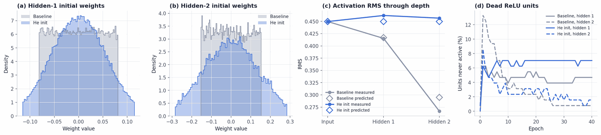
*Initialization: initialization diagnostics.*

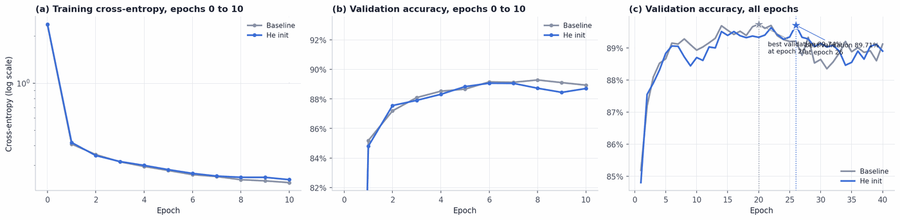
*Initialization: initialization early training.*

## L2 regularization

The penalty λΣW² trades training fit for smaller weights. The question was how much trade is worth it.

- **H5 (✅ supported).** λ = 0.01 was too strong: relative to He, clean training accuracy changed by -7.22 pp and best validation accuracy by -3.05 pp, the signature of underfitting. *Proof:* vs. He: clean training accuracy -7.22 pp, best validation accuracy -3.05 pp.
- **H6 (✅ supported).** A moderate penalty (λ = 0.001) narrowed the gap from 4.19 pp to 1.78 pp (58% smaller), at a validation cost of -0.83 pp. *Proof:* clean gap 4.19 pp → 1.78 pp (58% smaller); best validation accuracy -0.83 pp vs. He.
- **H10 (✅ supported).** The penalty removed weight from pixels that carry no information: the alignment between weight magnitude and pixel variability rose from r = -0.82 to r = 0.76. *Proof:* correlation of first-layer weight magnitude with pixel variability: He -0.82, L2 0.001 0.76.

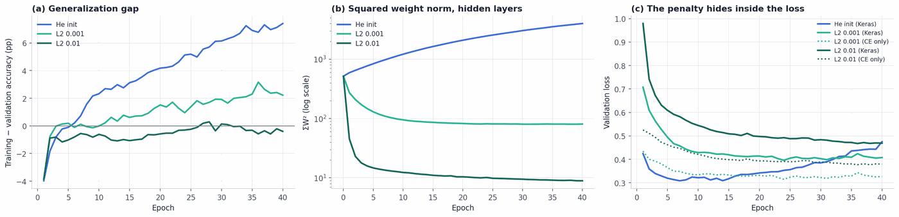
*L2 regularization: l2 mechanics.*

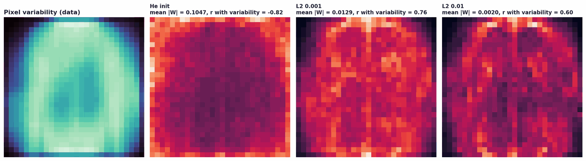
*L2 regularization: first layer weight maps.*

## Dropout

Dropout trains a random sub-network at every step. The question was whether it narrows the gap without costing accuracy, and why its training accuracy can sit below validation accuracy.

- **H7 (❌ not supported).** Dropout at p = 0.2 did not deliver the predicted balance (gap 4.19 pp → 3.59 pp; validation +0.54 pp, band ±0.84 pp). *Proof:* clean gap 4.19 pp → 3.59 pp (14% smaller); best validation accuracy +0.54 pp vs. He (band ±0.84 pp).
- **H8 (✅ supported).** Training accuracy below validation accuracy under dropout is a measurement effect: it happened in 37 epochs, but with dropout switched off training accuracy was 92.04% against 89.49% on validation. *Proof:* Keras training accuracy below validation in 37 epochs; at the best epoch clean training 92.04% vs. validation 89.49%.

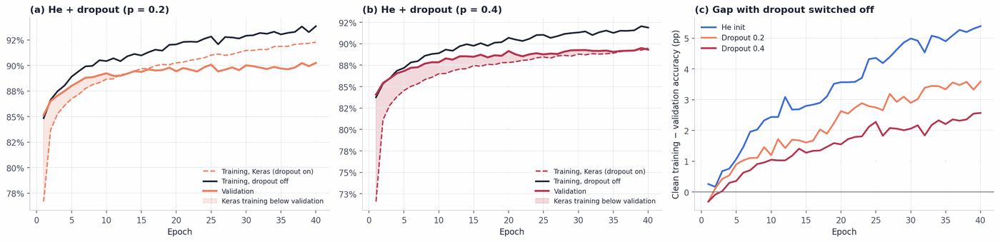
*Dropout: dropout three accuracies.*

## Overfitting, calibration, and early stopping

Accuracy alone hides how a model fails. These tests look at the loss and the probabilities.

- **H4 (✅ supported).** The unregularized baseline overfit in confidence rather than in accuracy: validation CE rose 43% after epoch 8, while accuracy ended only 0.62 pp below its best. *Proof:* validation CE rises 43% after its minimum at epoch 8; validation accuracy at the last epoch is 0.62 pp below its best.
- **H9 (✅ supported).** Continued training without regularization degraded calibration more (+2.45 pp ECE for He vs. +0.00 pp for He + dropout (p = 0.2)). *Proof:* ECE change from best epoch to the last epoch: He +2.45 pp, He + dropout (p = 0.2) +0.00 pp.

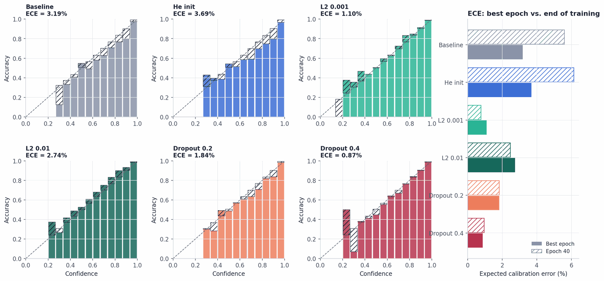
*Overfitting, calibration, and early stopping: calibration.*

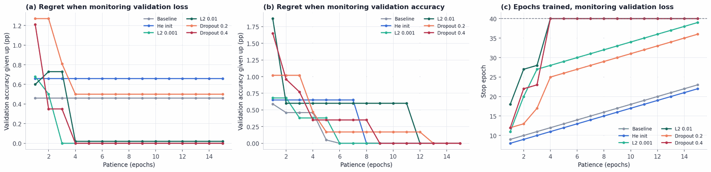
*Overfitting, calibration, and early stopping: early stopping.*

## Errors, robustness of the ranking, and the search

The last group asks whether the conclusions survive scrutiny from other angles.

- **H11 (✅ supported).** Errors are concentrated where garments genuinely look alike (Spearman ρ = 0.69, p = 1.8e-07). *Proof:* Spearman ρ = 0.69 (p = 1.8e-07) across 45 class pairs.
- **H12 (✅ supported).** The search agreed with the controlled experiments: the initializer was the least important hyperparameter (l2 0.60, dropout 0.35, init 0.04). *Proof:* importance (fANOVA): l2 0.60, dropout 0.35, init 0.04.
- **H13 (❌ not supported).** The validation choice transferred less well than expected (90.25% → 88.86%, -1.39 pp). *Proof:* validation 90.25%, test 88.86% (-1.39 pp); 95% Wilson interval 88.23% to 89.46%.

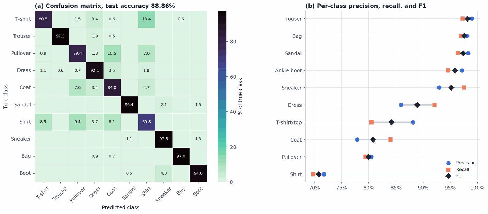
*Errors, robustness of the ranking, and the search: confusion and per class.*

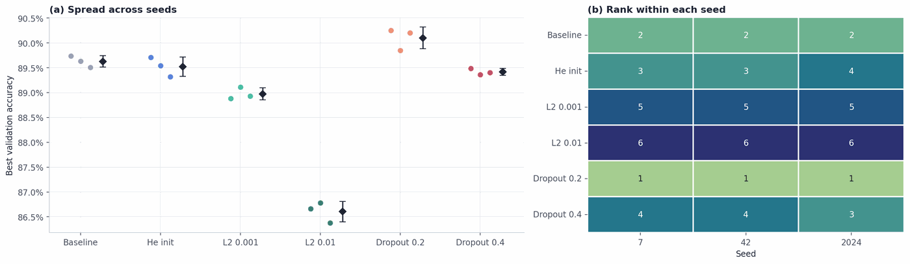
*Errors, robustness of the ranking, and the search: seed robustness.*

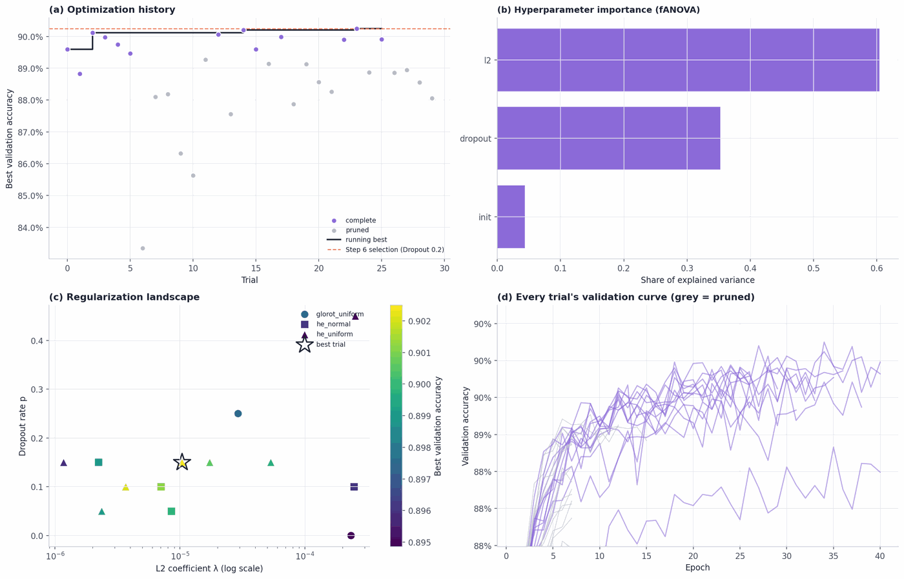
*Errors, robustness of the ranking, and the search: optuna.*

## Conclusions

What the evidence supports, in order of the study:

1. Variance-propagation theory predicts the untrained network well: the Glorot/He activation ratio was 0.584 against a predicted 0.656 (error 10.9%).
2. Initialization mattered mostly at the start: the early difference was -0.05 pp, the best-epoch difference -0.03 pp.
3. He initialization did not change the final result beyond noise (-0.10 pp; 3-seed means; noise threshold 2 × max SD = 0.39 pp).
4. The unregularized baseline overfit in confidence rather than in accuracy: validation CE rose 43% after epoch 8, while accuracy ended only 0.62 pp below its best.
5. λ = 0.01 was too strong: relative to He, clean training accuracy changed by -7.22 pp and best validation accuracy by -3.05 pp, the signature of underfitting.
6. A moderate penalty (λ = 0.001) narrowed the gap from 4.19 pp to 1.78 pp (58% smaller), at a validation cost of -0.83 pp.
7. Training accuracy below validation accuracy under dropout is a measurement effect: it happened in 37 epochs, but with dropout switched off training accuracy was 92.04% against 89.49% on validation.
8. Continued training without regularization degraded calibration more (+2.45 pp ECE for He vs. +0.00 pp for He + dropout (p = 0.2)).
9. The penalty removed weight from pixels that carry no information: the alignment between weight magnitude and pixel variability rose from r = -0.82 to r = 0.76.
10. Errors are concentrated where garments genuinely look alike (Spearman ρ = 0.69, p = 1.8e-07).
11. The search agreed with the controlled experiments: the initializer was the least important hyperparameter (l2 0.60, dropout 0.35, init 0.04).

Where the predictions failed, which is equally informative:

- Dropout at p = 0.2 did not deliver the predicted balance (gap 4.19 pp → 3.59 pp; validation +0.54 pp, band ±0.84 pp).
- The validation choice transferred less well than expected (90.25% → 88.86%, -1.39 pp).

Taken together: initialization sets the starting point, regularization sets how much of the training fit transfers, and the
strength of regularization matters more than its type. Differences among the well-regularized models are of the same size as
run-to-run noise, so they are reported as a group rather than as a single winner (Bouthillier et al., 2021).

## Limitations

One stratified train–validation split, so data-sampling variance is not measured; 3 training seed(s); best-epoch
validation accuracy is the maximum of 40 noisy measurements and therefore slightly optimistic for every model; the optimizer
and learning rate were fixed by design. Calibration is measured but not corrected.

## References

Bouthillier, X., Delaunay, P., Bronzi, M., Trofimov, A., Nichyporuk, B., Szeto, J., Mohammadi Sepahvand, N., Raff, E., Madan, K., Voleti, V., Ebrahimi Kahou, S., Michalski, V., Arbel, T., Pal, C., Varoquaux, G., & Vincent, P. (2021). Accounting for variance in machine learning benchmarks. *Proceedings of Machine Learning and Systems, 3*. https://proceedings.mlsys.org/paper_files/paper/2021/hash/0184b0cd3cfb185989f858a1d9f5c1eb-Abstract.html

Cawley, G. C., & Talbot, N. L. C. (2010). On over-fitting in model selection and subsequent selection bias in performance evaluation. *Journal of Machine Learning Research, 11*, 2079–2107.

Glorot, X., & Bengio, Y. (2010). Understanding the difficulty of training deep feedforward neural networks. In *Proceedings of the Thirteenth International Conference on Artificial Intelligence and Statistics* (Vol. 9, pp. 249–256). PMLR.

Goodfellow, I., Bengio, Y., & Courville, A. (2016). *Deep learning*. MIT Press.

Guo, C., Pleiss, G., Sun, Y., & Weinberger, K. Q. (2017). On calibration of modern neural networks. In *Proceedings of the 34th International Conference on Machine Learning* (Vol. 70, pp. 1321–1330). PMLR.

He, K., Zhang, X., Ren, S., & Sun, J. (2015). Delving deep into rectifiers: Surpassing human-level performance on ImageNet classification. In *Proceedings of the IEEE International Conference on Computer Vision* (pp. 1026–1034). https://doi.org/10.1109/ICCV.2015.123

Hutter, F., Hoos, H., & Leyton-Brown, K. (2014). An efficient approach for assessing hyperparameter importance. In *Proceedings of the 31st International Conference on Machine Learning* (Vol. 32, pp. 754–762). PMLR.

Kingma, D. P., & Ba, J. (2015). Adam: A method for stochastic optimization. In *Proceedings of the 3rd International Conference on Learning Representations*. https://arxiv.org/abs/1412.6980

Krogh, A., & Hertz, J. A. (1991). A simple weight decay can improve generalization. In J. Moody, S. Hanson, & R. P. Lippmann (Eds.), *Advances in Neural Information Processing Systems* (Vol. 4, pp. 950–957). Morgan Kaufmann.

Naeini, M. P., Cooper, G. F., & Hauskrecht, M. (2015). Obtaining well calibrated probabilities using Bayesian binning. In *Proceedings of the Twenty-Ninth AAAI Conference on Artificial Intelligence* (pp. 2901–2907). https://doi.org/10.1609/aaai.v29i1.9602

Nosek, B. A., Ebersole, C. R., DeHaven, A. C., & Mellor, D. T. (2018). The preregistration revolution. *Proceedings of the National Academy of Sciences, 115*(11), 2600–2606. https://doi.org/10.1073/pnas.1708274114

Srivastava, N., Hinton, G., Krizhevsky, A., Sutskever, I., & Salakhutdinov, R. (2014). Dropout: A simple way to prevent neural networks from overfitting. *Journal of Machine Learning Research, 15*(56), 1929–1958.

Xiao, H., Rasul, K., & Vollgraf, R. (2017). *Fashion-MNIST: A novel image dataset for benchmarking machine learning algorithms* (arXiv:1708.07747). arXiv. https://doi.org/10.48550/arXiv.1708.07747
